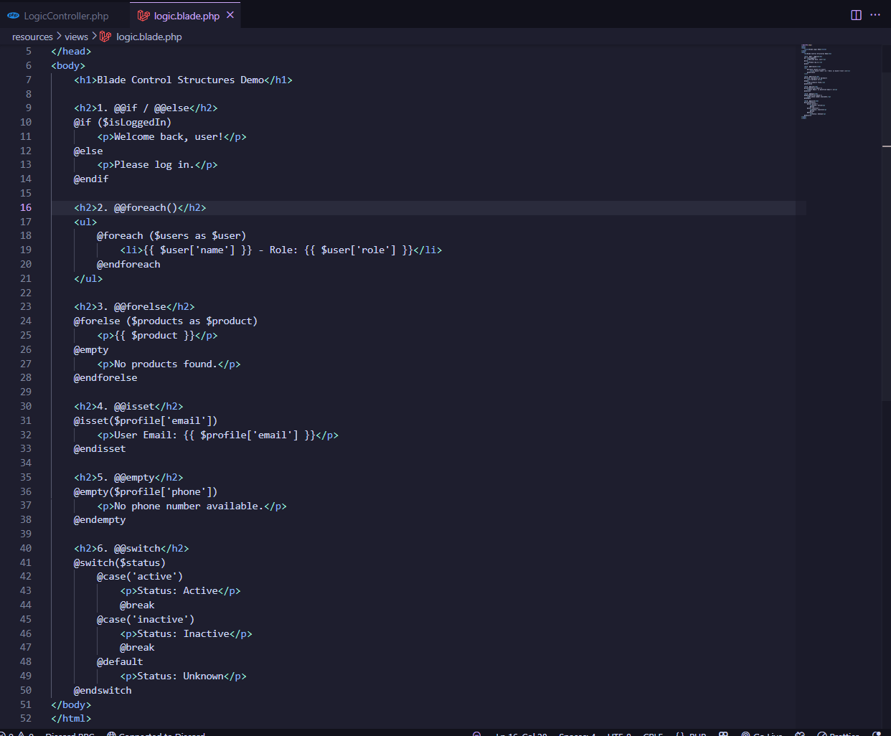
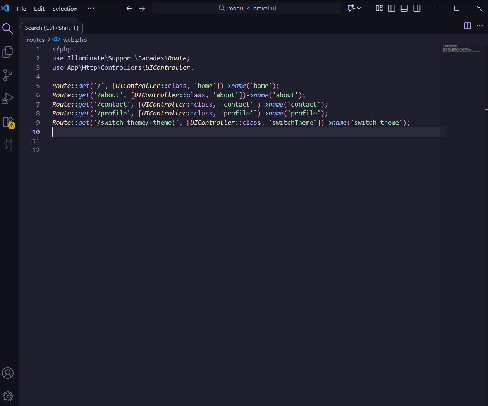

# Laporan Modul 4: Laravel Blade Template Engine

**Mata Kuliah:** Workshop Web Lanjut  
**Nama:** Hayzar Muhaiyar
**NIM:** 2024573010100
**Kelas:** TI-2C

---

## Abstrak

Pada praktikum ini, mahasiswa mempelajari konsep dan penerapan Blade Template Engine pada framework Laravel. Blade digunakan untuk memisahkan logika dan tampilan dalam arsitektur MVC (Model-View-Controller), sehingga proses pengembangan web menjadi lebih efisien dan terstruktur. Tujuan dari praktikum ini adalah memahami sintaks dasar Blade, penggunaan layout dan inheritance, serta memanfaatkan fitur Blade untuk menampilkan data dan kontrol alur tampilan.

---

## 1. Dasar Teori
Blade Template Engine merupakan sistem templating bawaan Laravel yang memungkinkan pengembang membuat tampilan dinamis dengan sintaks sederhana. Blade tidak menghalangi penggunaan PHP biasa, tetapi memberikan fitur tambahan seperti:

- Template Inheritance: memungkinkan pembuatan layout utama (layout.blade.php) yang bisa diwarisi oleh halaman lain.

- Section & Yield: digunakan untuk mendefinisikan area konten dalam template.

- Control Structure: mendukung penggunaan perintah seperti @if, @foreach, dan @for untuk mengontrol logika tampilan.

- Component & Include: memudahkan penggunaan ulang kode tampilan seperti header, footer, atau form.

Blade akan dikompilasi menjadi file PHP murni dan disimpan dalam cache untuk meningkatkan performa aplikasi.

---

## 2. Langkah-Langkah Praktikum

Praktikum 1: Meneruskan Data dari Controller ke Blade View

- Langkah 1: Buat dan Buka Proyek laravel
  laravel new modul-4-blade-view
  cd modul-4-blade-view
  code .

- Langkah 2: Buat Sebuah Controller
  php artisan make:controller DasarBladeController
  ini akan membuat app/Http/Controllers/DasarBladeController.php.

- Langkah 3: Definisikan Rute
  Buka Routes/Web.php Dan isi dengan code berikut
  

- Langkah 4: Buat Metode Untuk menghandle Data pada Controller
  Buka app/Http/controllers/dasarbladecontroller.php
  Isi Dengan Code Berikut
  

- Langkah 5: Buat Blade View
  Buat File Baru di Direktori resources/views/dasar.blade.php:
  Isi Dengan Code Berikut
  

- Langkah 6: Uji Rute
  Mulai Php Artisan serve
  Buka Browser Dan Kunjungi
  http://127.0.0.1:8000/dasar
  

Praktikum 2: Menggunakan Struktur Kontrol Blade

- Langkah 1: Buat Controller Baru
  Di Dalam Project Modul-4-blade-view Bikin sebuah controller  
  php artisan make:controller LogicController
  Ini membuat app/Http/Controllers/LogicController.php.

- Langkah 2: Tambahkan route baru
  Buka routes/web.php dan tambahkan:
        

- Langkah 3: Tambahkan Logika Di Controller
  Kemudian, isi dengan code berikut  
     

- Langkah 4: Buat Blade View
  Buat file view Di direktori resources/views/logic.blade.php:
  Kemudian Isi Dengan Code Berikut
     

- Langkah 5: Jalankan Aplikasi
  Jalankan Server Pengembangan
  php php artisan serve  
  Akses aplikasi di:
  http://127.0.0.1:8000/logic 
  

Praktikum 3: Layout dan Personalisasi di Laravel 12 dengan Bootstrap

- Langkah 1: Buat Controller baru
  Masih Sama Di dalam Projek modul-4-view, untuk kali ini akan membuat controller untuk menangani rute   dan logika kita:
  php artisan make:controller PageController

- Langkah 2: Menambahkan Route
  Di Dalam Routes/web.php kita akan menambahkan rute baru:
  berikut adalah codenya:
        

- Langkah 3: Update Controller
  Di dalam direktori app/Http/Controllers/PageController.php Isikan Kode Berikut
         
    
- Langkah 4: Buat Layout Dasar dengan Bootstrap
  Di dalam direktori resources/view bikin folder layouts kemudian di dalamnya buat file app.blade.php
  dan isi dengan code berikut:
  

- Langkah 5: Buat view untuk Admin
  Buat direktori admin di resources/views
  Kemudian, buat resources/views/admin/dashboard.blade.php:
  Dan Isi dengan Code Berikut:
  

- Langkah 6: Buat view untuk User
  Buat direktori user di resources/views
  Kemudian, buat resources/views/user/dashboard.blade.php:
  Dan isi dengan Code Berikut:
  

- Langkah 7: Jalankan Aplikasi
  php artisan serve
  Buka browser dan kunjungi
  Admin: http://127.0.0.1:8000/admin
  User: http://127.0.0.1:8000/user
  Berikut adalah Hasilnya
  
  

Praktikum 4: Partial Views, Blade Components, dan Theme Switching di Laravel 12

  Langkah 1: Buat Dan Buka Proyek Laravel Baru
  laravel new modul-4-laravel-ui
  cd modul-4-laravel-ui
  code .

  Langkah 2: Buat Controller
  Ketik ini di terminal :
  php artisan make:controller UIController

  Langkah 3: Definisikan Routes
  Buka Routes/web.php Dan Tambahkan Code Berikut:
  

  Langkah 4: Update Controller
  Buka File UIController.php di Direktori app/Http/Controllers/UIController.php
  Kemudian Isi dengan Code Berikut
  

  Langkah 5: Buat Layout Utama Dengan Theme Support
  Buat Direktori layout di resources/view kemudian Bikin File 
  app.blade.php Dan isi Dengan Code Berikut:
  

  Langkah 6: Buat Partial View
  Buat Direktori Partial Di resources/view dan bikin file
  navigation.blade.php kemudian isi code Berikut
  

  Langkah 7: Buat Blade Components
  Ketik ini di dalam terminal:
  php artisan make:component Footer
  php artisan make:component FeatureCard
  php artisan make:component TeamMember
  php artisan make:component ContactForm
  Kemudian, Edit resources/views/components/footer.blade.php:
  Isi Dengan Code Berikut:
  
  Selanjutnya Edit resources/views/components/feature-card.blade.php
  Isi Dengan Code Berikut:
   
   Dan Edit resources/view/components/team-member.blade.php
   Isi Dengan Code Berikut:
   

   Langkah 8: Buat Main Views
   Buat View-view Utama:
   1. resources/views/home.blade.php
   Isi Dengan Code Berikut:
   
   2. resources/views/about.blade.php
   Isi Dengan Code Berikut:
   
   3. resources/views/partials/team-stats.blade.php
   Isi Dengan Code Berikut:
   
   4. resources/views/contact.blade.php 
   Isi Dengan Code Berikut:
   
   5. resources/views/components/contact-form.blade.php
   Isi dengan Code Berikut:
   
   6. resources/views/profile.blade.php
   Isi Dengan Code Berikut:
   

   Langkah 9: Jalankan Dan Test Aplikasi
   Jalankan php artisan serve di Terminal
   Kemudian Buka Browser Dan kunjungi:
   Home:    http://127.0.0.1:8000
   about:   http://127.0.0.1:8000/about
   Contact: http://127.0.0.1:8000/contact
   Profile: http://127.0.0.1:8000/profile
   Berikut Gambar hasilnya
   - Hasil Home:
   
   - Hasil About:
   
   - Hasil Contact:
   
   - Hasil Profile:
   

---

## 3. Hasil dan Pembahasan

Jelaskan apa hasil dari praktikum yang dilakukan.
Pada Praktikum 4 ini, Anda telah berhasil:

- Membuat aplikasi Laravel lengkap dengan multiple pages
- Mengimplementasikan Partial Views menggunakan @include directive
- Membuat dan menggunakan Blade Components dengan props dan slots
- Mengembangkan sistem Theme Switching dengan session persistence
- Menggunakan Bootstrap 5 untuk responsive design
- Membuat perbandingan langsung antara partial views vs components
- Menerapkan best practices dalam struktur view Laravel

Aplikasi ini menunjukkan bagaimana ketiga konsep (partial views, Blade components, dan theme switching) dapat bekerja bersama dalam satu project yang kohesif dan mudah dipelihara.

---

## 4. Kesimpulan

Dari praktikum ini dapat disimpulkan bahwa Blade Template Engine merupakan komponen penting dalam framework Laravel untuk memisahkan logika dan tampilan aplikasi.
Beberapa hal penting yang dipelajari antara lain:
- Blade mempermudah pembuatan tampilan dinamis melalui sintaks sederhana.
- Penggunaan layout dan inheritance mempercepat proses pembuatan halaman dengan struktur yang konsisten.
- Partial view dan component meningkatkan efisiensi dan konsistensi kode tampilan.
- Integrasi dengan Bootstrap menjadikan hasil tampilan lebih menarik dan responsif.

Secara keseluruhan, praktikum ini membantu mahasiswa memahami pentingnya arsitektur terstruktur dalam pengembangan aplikasi web modern menggunakan Laravel.

---

## 5. Referensi
- chatgpt.com
- https://hackmd.io/@mohdrzu/r1AIUzWpll#Praktikum-4---Partial-Views-Blade-Components-dan-Theme-Switching-di-Laravel-12
https://laravel.com/docs

---
