# Laporan Modul 8: Authentication & Authorization

**Mata Kuliah:** Workshop Web Lanjut  
**Nama:** Hayzar Muhaiyar
**NIM:** 2024573010100
**Kelas:** TI-2C

---

## Abstrak

Autentikasi dan otorisasi merupakan aspek fundamental dalam pengembangan aplikasi web modern yang berfungsi untuk menjaga keamanan dan pengelolaan akses pengguna. Autentikasi bertujuan untuk memverifikasi identitas pengguna, sedangkan otorisasi menentukan hak akses pengguna terhadap sumber daya tertentu di dalam sistem. Pada modul ini dilakukan praktikum implementasi autentikasi dan otorisasi menggunakan framework Laravel 12 dengan starter kit Laravel Breeze. Praktikum pertama berfokus pada penerapan autentikasi dasar seperti registrasi, login, dan proteksi rute menggunakan middleware *auth*. Praktikum kedua membahas implementasi otorisasi berbasis peran (*Role-Based Access Control*) dengan mendefinisikan peran admin, manager, dan user. Hasil praktikum menunjukkan bahwa Laravel menyediakan mekanisme yang efektif, aman, dan terstruktur untuk membangun sistem autentikasi dan otorisasi pada aplikasi web.

---

## 1. Dasar Teori

Autentikasi (*authentication*) adalah proses verifikasi identitas pengguna untuk memastikan bahwa pengguna tersebut adalah pihak yang sah. Proses ini umumnya dilakukan melalui kombinasi kredensial seperti email dan kata sandi. Sementara itu, otorisasi (*authorization*) merupakan proses penentuan hak akses pengguna terhadap fitur atau sumber daya tertentu setelah pengguna berhasil terautentikasi.

Laravel sebagai framework PHP modern menyediakan sistem autentikasi dan otorisasi yang kuat melalui middleware, guards, gates, dan policies. Laravel Breeze merupakan starter kit resmi Laravel yang menyediakan implementasi autentikasi sederhana meliputi registrasi, login, logout, manajemen sesi, dan reset kata sandi. Breeze memanfaatkan hashing bcrypt untuk pengamanan kata sandi serta middleware *auth* untuk membatasi akses rute.

Untuk otorisasi yang lebih kompleks, Laravel mendukung kontrol akses berbasis peran (*Role-Based Access Control* / RBAC). RBAC memungkinkan pengelompokan pengguna berdasarkan peran tertentu seperti admin, manager, atau user, sehingga setiap peran memiliki hak akses yang berbeda. Pendekatan ini membuat sistem lebih terstruktur, mudah dikembangkan, dan aman untuk aplikasi berskala menengah hingga besar.

---

## 2. Langkah-Langkah Praktikum

### 2.1 Praktikum 1 – Autentikasi dengan Laravel Breeze

1. Membuat proyek Laravel baru dan mengonfigurasi database MySQL.
- laravel new auth-lab
cd auth-lab
code .

- Pastikan MySQL berjalan dan buat database:
CREATE DATABASE authlab_db;

- Konfigurasi MySQL:
- Edit file .env:
DB_CONNECTION=mysql
DB_HOST=127.0.0.1
DB_PORT=3306
DB_DATABASE=authlab_db
DB_USERNAME=<username database anda>
DB_PASSWORD=<password database anda jika ada>

- Bersihkan config cache:
php artisan config:clear

2. Menginstal Laravel Breeze menggunakan Composer.
Kita akan menggunakan Laravel Breeze untuk scaffolding autentikasi. Jalankan perintah berikut di terminal:
- composer require laravel/breeze --dev

Kemudian, jalankan perintah berikut untuk menginstal Breeze:
- php artisan breeze:install

Selama proses instalasi, Anda akan diminta beberapa opsi:
- Pilih frontend framework: Pilih blade
Dark mode: Pilih yes (opsional)

3. Melakukan instalasi Breeze dengan memilih Blade sebagai frontend.
 Selama proses instalasi, Anda akan diminta beberapa opsi:
- Pilih frontend framework: Pilih blade
Dark mode: Pilih yes (opsional)

Lanjutkan dengan perintah berikut:
- npm install

4. Menjalankan migrasi database untuk membuat tabel users.
Jalankan Dengan perintah berikut:
- php artisan migrate

5. Menjalankan server Laravel dan mengakses fitur registrasi dan login.

Setelah menyelesaikan instalasi, jalankan perintah berikut untuk memulai server development:
php artisan serve
Buka browser anda dan unjungi
http://localhost:8000

6. Membuat rute `/myprofile` yang dilindungi middleware `auth`.

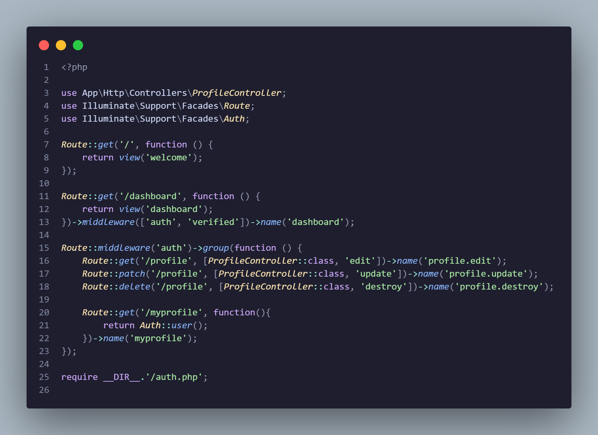    

7. Menguji rute untuk memastikan hanya pengguna terautentikasi yang dapat mengakses data profil.

Login terlebih dahulu ke aplikasi:
Kunjungi http://localhost:8000/myprofile

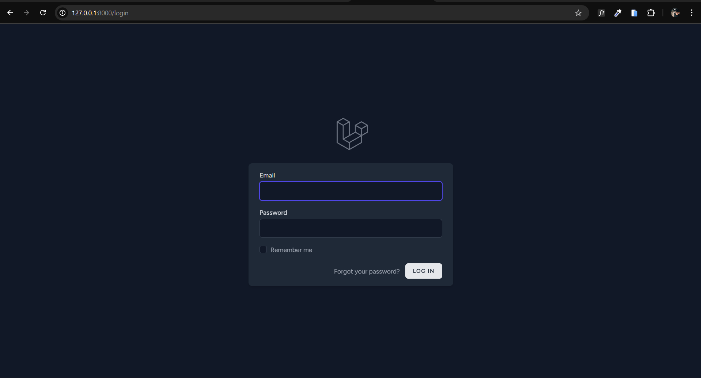    

- Verifikasi bahwa Anda melihat data user dalam format JSON yang berisi:
id, name, email, email_verified_at, created_at, updated_at
Anda dapat mengedit profil dengan mengklik tautan Profile. Ini akan membawa Anda ke halaman edit profil di mana Anda dapat memperbarui nama, email, dan kata sandi Anda.

### 2.2 Praktikum 2 – Otorisasi Berbasis Peran

1. Membuat proyek Laravel baru dan mengonfigurasi database.
- Kita akan membuat proyek Laravel baru:
laravel new role-lab
cd role-lab
code .

- Pastikan MySQL berjalan dan buat database:
CREATE DATABASE authrole_db;

- Konfigurasi MySQL:
Edit file .env:
DB_CONNECTION=mysql
DB_HOST=127.0.0.1
DB_PORT=3306
DB_DATABASE=authrole_db
DB_USERNAME=<username database anda>
DB_PASSWORD=<password database anda jika ada>

2. Menginstal Laravel Breeze sebagai sistem autentikasi dasar.
- Kita akan menggunakan Laravel Breeze untuk scaffolding autentikasi. Jalankan perintah berikut di terminal:
composer require laravel/breeze --dev

- Kemudian, jalankan perintah berikut untuk menginstal Breeze:
php artisan breeze:install

- Selama proses instalasi, Anda akan diminta beberapa opsi:
Pilih frontend framework: Pilih blade
Dark mode: Pilih yes (opsional)

- Lanjutkan dengan perintah berikut:
npm install
php artisan migrate

3. Menambahkan kolom `role` pada tabel users melalui migration.
- Buat migration:
php artisan make:migration add_role_to_users_table --table=users

- Kemudian Edit file migration dengan code berikut:
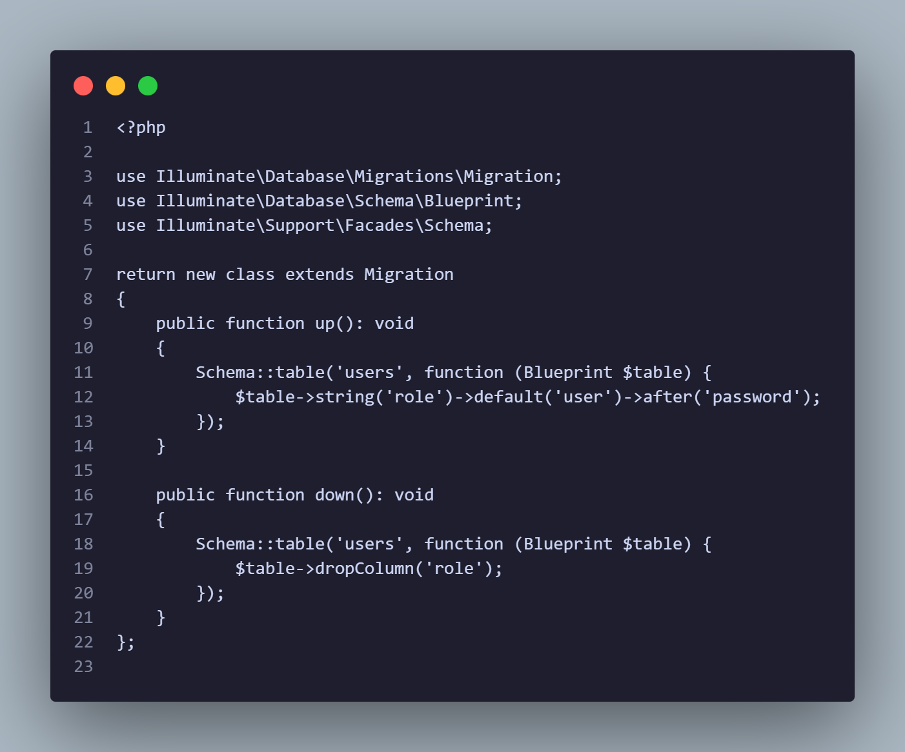
- Kemudian jalankan:
php artisan migrate  

4. Melakukan seeding database untuk membuat pengguna dengan peran admin, manager, dan user.
- Edit database/seeders/DatabaseSeeder.php:

- Kemudian jalankan: 
php artisan db:seed

5. Membuat middleware kustom `RoleMiddleware` untuk validasi peran.
- Generate middleware:
php artisan make:middleware RoleMiddleware

- Kemudian, update app/Http/Middleware/RoleMiddleware.php:
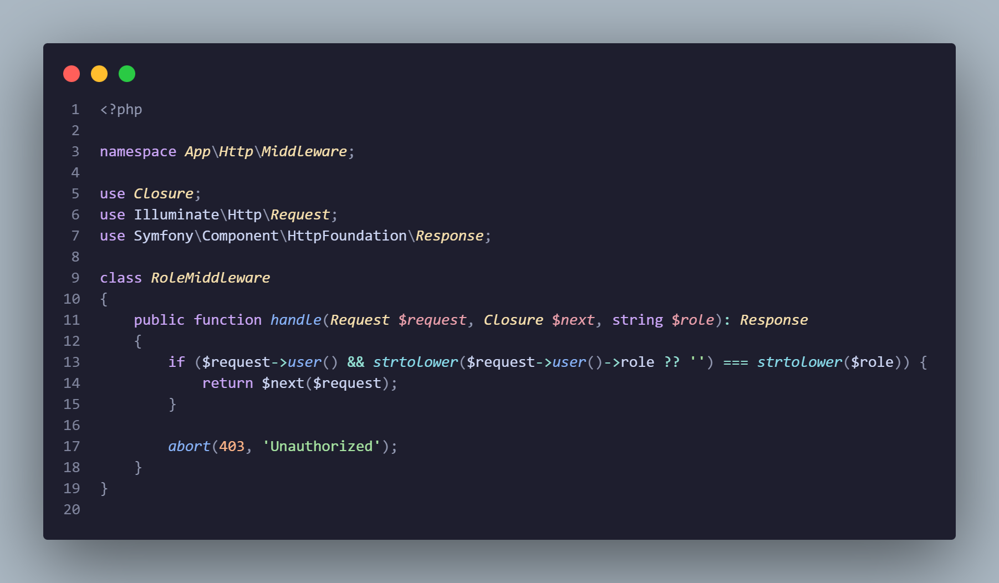

6. Mendaftarkan middleware role pada konfigurasi aplikasi.
- daftarkan di bootstrap\app.php di dalam withMiddleware():
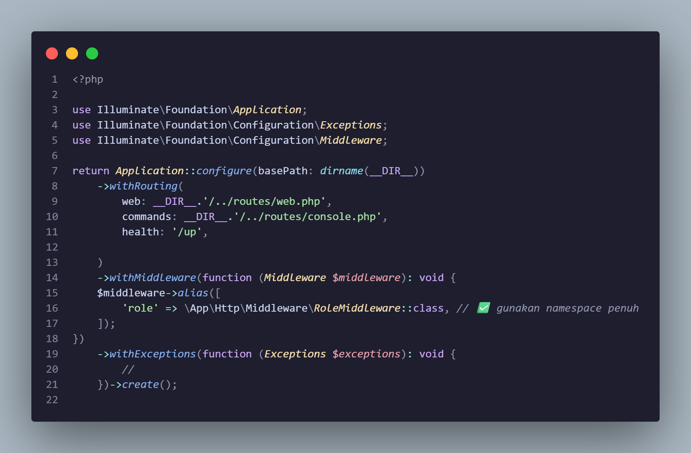

7. Membuat view khusus untuk setiap peran serta view umum.
- Di resources/views, buat:
admin.blade.php
manager.blade.php
user.blade.php
all.blade.php

- Kode untuk resources/views/admin.blade.php:

- Kode untuk resources/views/manager.blade.php
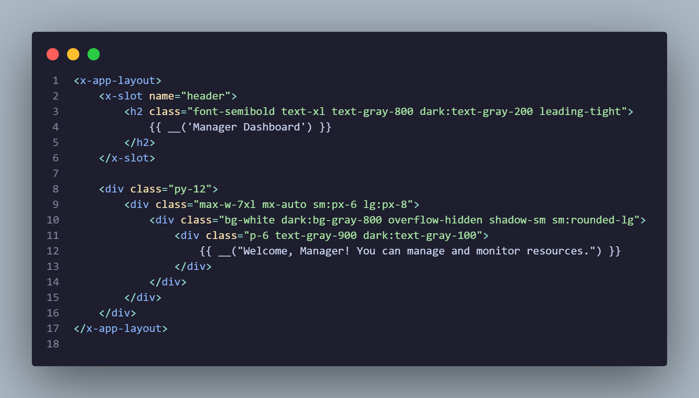
- Kode untuk resources/views/user.blade.php
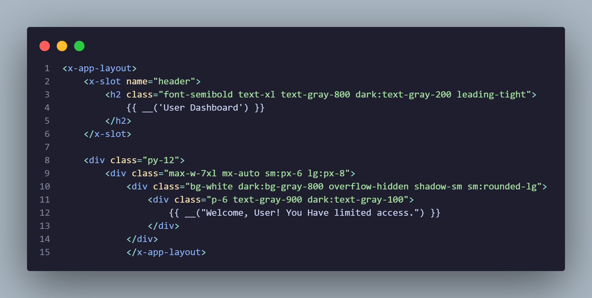
- Kode untuk resources/views/all.blade.php
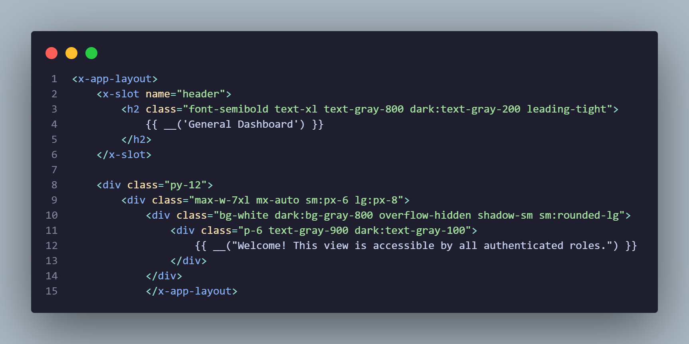

8. Mendefinisikan rute yang dibatasi berdasarkan peran pengguna.
- Kita akan mendefinisikan rute untuk setiap peran dan view umum. Buka routes/web.php dan tambahkan kode berikut:
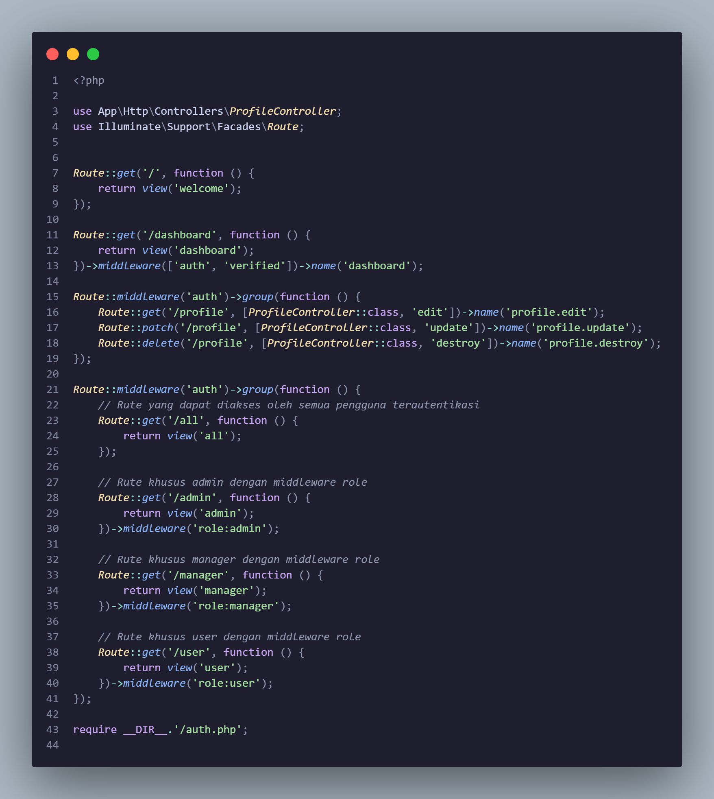

9. Melakukan pengujian akses rute menggunakan akun dengan peran berbeda.
- Setelah menyelesaikan semua langkah, kita sekarang dapat menguji aplikasi. Jalankan perintah berikut untuk memulai server development Laravel:
php artisan serve

- Kunjungi http://localhost:8000 dan login menggunakan pengguna yang telah disediakan:
Admin: admin@ilmudata.id / password123
Manager: manager@ilmudata.id / password123
User: user@ilmudata.id / password123

- Kemudian, coba akses:
/admin
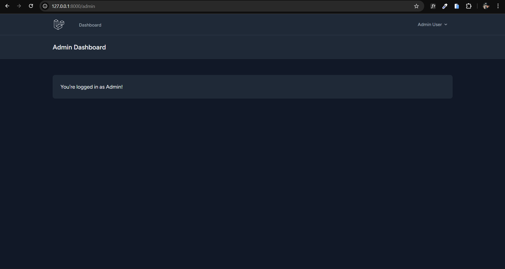
/manager
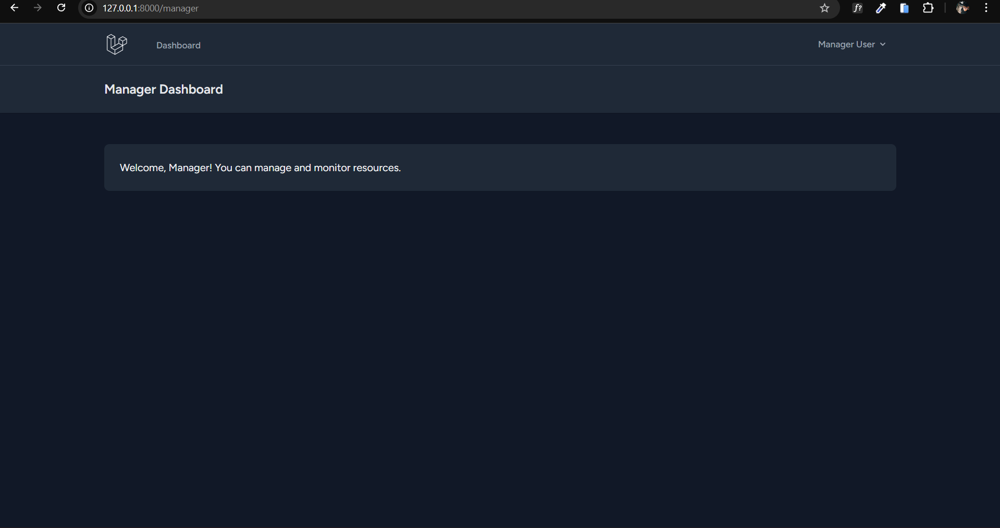
/user
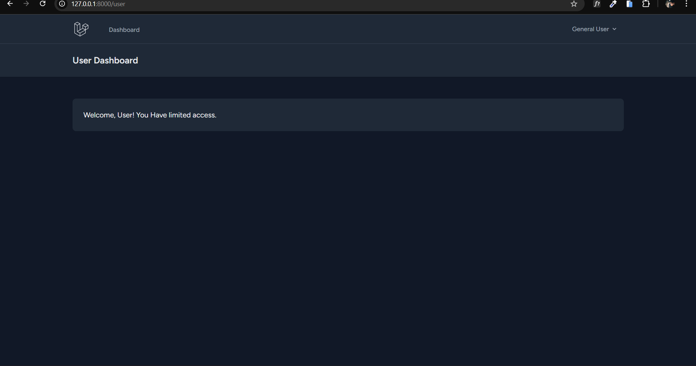
/all
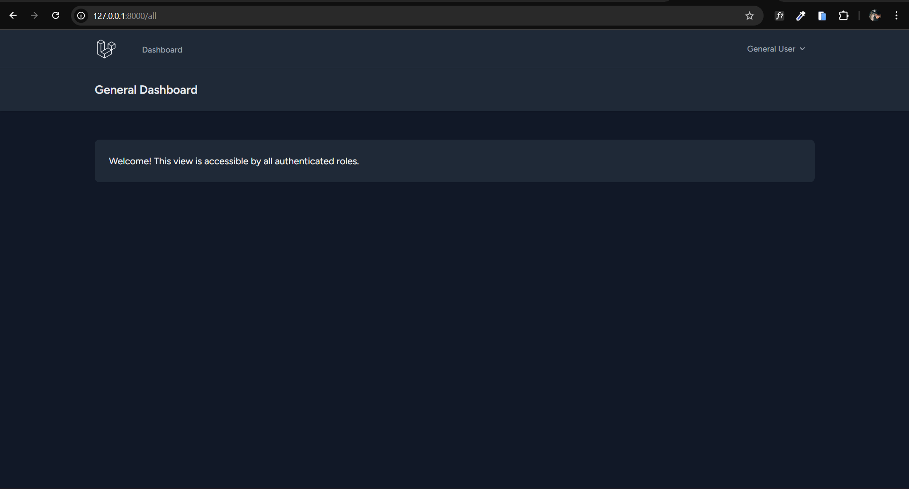

---

## 3. Hasil dan Pembahasan

Hasil dari praktikum pertama menunjukkan bahwa Laravel Breeze berhasil menyediakan sistem autentikasi yang lengkap dan siap digunakan. Pengguna dapat melakukan registrasi, login, logout, serta mengelola profil dengan aman. Middleware `auth` terbukti efektif dalam membatasi akses rute sehingga hanya pengguna yang telah login yang dapat mengakses halaman tertentu seperti profil.

Pada praktikum kedua, implementasi RBAC berjalan sesuai dengan yang diharapkan. Setiap pengguna hanya dapat mengakses halaman yang sesuai dengan perannya. Pengguna dengan peran admin memiliki akses penuh ke halaman admin, manager hanya dapat mengakses halaman manager, dan user hanya dapat mengakses halaman user. Halaman umum dapat diakses oleh seluruh pengguna yang telah terautentikasi. Middleware kustom yang dibuat mampu menangani validasi peran secara sederhana namun efektif.

---

## 4. Kesimpulan

Berdasarkan praktikum yang telah dilakukan, dapat disimpulkan bahwa Laravel 12 dengan starter kit Breeze mampu menyediakan sistem autentikasi yang aman dan mudah diimplementasikan. Autentikasi dasar seperti login, registrasi, dan proteksi rute dapat diterapkan dengan cepat menggunakan middleware bawaan Laravel. Selain itu, implementasi otorisasi berbasis peran menggunakan middleware kustom terbukti efektif dalam membatasi akses pengguna sesuai dengan perannya masing-masing.

Modul ini memberikan pemahaman yang kuat mengenai konsep autentikasi dan otorisasi serta penerapannya secara langsung pada aplikasi web. Dengan pendekatan ini, pengembang dapat membangun aplikasi yang lebih aman, terstruktur, dan mudah dikembangkan di masa depan.

---

## 5. Referensi

1. Laravel Documentation. *Authentication*. https://laravel.com/docs/authentication  
2. Laravel Documentation. *Authorization*. https://laravel.com/docs/authorization  
3. Laravel Documentation. *Laravel Breeze*. https://laravel.com/docs/starter-kits  
4. OWASP Foundation. *Authentication and Authorization*. https://owasp.org  
