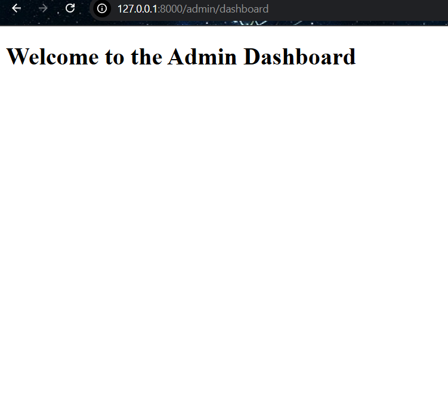

# Laporan Modul 3: Laravel Controller
**Mata Kuliah:** Workshop Web Lanjut   
**Nama:** Hayzar Muhaiyar  
**NIM:** 2024573010100
**Kelas:** TI-2C
---
## Abstrak 
Laporan ini membahas penerapan Controller pada framework Laravel 12 dalam konteks arsitektur Model-View-Controller (MVC). Tujuan dari praktikum ini adalah untuk memahami peran controller sebagai penghubung antara model dan view, serta bagaimana controller mengatur logika aplikasi, menangani request pengguna, dan mengembalikan response yang sesuai. Melalui tiga percobaan praktikum — menangani request dan response, penggunaan route grouping, serta penerapan prefix dan namespace — mahasiswa diharapkan mampu membangun struktur aplikasi web yang lebih terorganisir, efisien, dan mudah dikembangkan. Hasil akhir dari praktikum ini menunjukkan bahwa controller berperan penting dalam mengelola alur data dan tampilan aplikasi secara terstruktur di Laravel.
---
## 1. Dasar Teori
-Apa Itu Controller
Dalam pola MVC (Model-View-Controller), sebuah controller bertindak sebagai jembatan antara model dan view. Controller menangani input pengguna, berinteraksi dengan model untuk data, dan mengembalikan respons yang benar, yang seringkali merender sebuah view.
-Jelaskan fungsi utama Controller dalam arsitektur MVC pada Laravel.
Controller berfungsi sebagai penghubung antara Model dan View. Ia menangani logika bisnis aplikasi, menerima permintaan (request) dari pengguna melalui route, memproses data menggunakan model (jika diperlukan), dan mengirimkan hasilnya ke view untuk ditampilkan.
-Sebutkan dan jelaskan tiga jenis controller yang ada di Laravel.
1. Basic Controllers (Controller Dasar)
2. Resource Controllers (Controller Sumber Daya)
3. Invokable Controllers (Controller yang Dapat Dipanggil)
--- 

## 2. Langkah-Langkah Praktikum
Tuliskan langkah-langkah yang sudah dilakukan, sertakan potongan kode dan screenshot hasil.

2.1 Praktikum 1 – Menangani Request dan Response View di laravel 12

- Langkah 1 : Buat Dan Buka Proyek Laravel
composer create-project laravel/laravel:^12.0.3 lab-view
cd lab-view
code .

- Langkah 2: Buat sebuah Controller
php artisan make:controller DemoController
Kemudian isi dengan kode berikut:

- Langkah 3: Definisikan Rute
Edit routes/web.php:
Kemudian Isi Dengan Code Berikut

- Langkah 4: Buat View Sederhana
Buat file Blade berikut di resources/views/:
Hello.blade.php
Greet.blade.php
Search.blade.php

Screenshot Hasil:
 

2.2 Praktikum 2 – Menggunakan Group Route
- Langkah 1 : Buat Dan Buka Proyek Laravel'
composer create-project laravel/laravel:^12.0.3 lab-group
cd lab-group
code .

- Langkah 2 : Buat Sebuah Controller
php artisan make:controller PageController
Kemudian Isi Dengan Code Berikut :
 

- Langkah 3 : Definisikan Rute Yang Dikelompokan
Kemudian Isi Dengan Code Berikut :
 

- Langkah 4 : Buat View Sederhana
-Buat Folder : resources/views/pages/
-Selanjutnya Buat File - Filr Berikut Di dalam Pages/

1. Home.blade.php
 
2. about.blade.php
 
3.contact.blade.php
 

Screenshot Hasil:
HasilHome
.png) 
HasilAbout
 
HasilContact

2.3 Praktikum 3 – Pengelompokan Prefix Dengan NameSpace Rute Di Laravel 12

Langkah 1: Buar Dan Buka Proyek Laravel
composer create-project laravel/laravel:^12.0.3 lab-prefix
cd lab-prefix
code .

Langkah 2: Buat Controller Dengan NameSpace
- php artisan make:controller Admin/DashboardController
- php artisan make:controller Admin/UserController

Langkah 3: Definisikan Kelompok Rute Dengan Prefix Dan NameSpace Controller
Kemudian Isi Dengan Code Berikut          
 

Langkah 4: Tambahkan Aksi Ke Controller
Kemudian Isi Dengan Code Berikut Untuk DashboardController.php

Selanjutnya Isi Code Berikut Untuk UsersController.php

Langkah 5: 
Buat View Sederhana
Buat folder dan file di bawah resources/views/admin/. Kemudian, buat file-file berikut:

dashboard.blade.php
users/index.blade.php

Isi Code Berikut pada Dashboard.blade.php

Selanjutnya membuat folder users di bawah resources/views/admin/ dan buat file index.blade.php di dalamnya. View users/index.blade.php adalah file HTML sederhana yang menampilkan daftar pengguna:
Kemudian Isi Dengan code berikut

Selanjutnya Bikin Show.blade.php
isi dengan code berikut

Screenshot Hasil:
Hasil Admin Dashboard

Hasil Admin Users

Hasil Users Detail

---
## 3. Hasil dan Pembahasan
Jelaskan apa hasil dari praktikum yang dilakukan.

Pada praktikum ini telah dibuat beberapa controller di Laravel untuk menangani request dan menampilkan view.

Praktikum 1: DemoController berhasil menampilkan halaman hello, greet, dan search sesuai route.

Praktikum 2: Menggunakan Route Group dengan PageController, halaman home, about, dan contact tampil dengan baik dan struktur route lebih rapi.

Praktikum 3: Penerapan prefix dan namespace berhasil memisahkan area admin (DashboardController dan UserController) dari user biasa, dengan hasil tampilan dashboard dan daftar user yang sesuai.

Secara keseluruhan, controller berfungsi menghubungkan route, logika aplikasi, dan tampilan secara terstruktur.

---
## 4. Kesimpulan

Tulis kesimpulan dari praktikum ini
Dalam bab ini, kita telah membahas dasar-dasar controller di Laravel 12, termasuk cara membuatnya, mendefinisikan rute, dan meneruskan data ke view. Kita juga mengeksplorasi berbagai jenis controller, seperti resource controller dan invokable controller, serta mempelajari cara mengelompokkan rute untuk organisasi yang lebih baik.

Kita juga membahas cara menangani permintaan, memvalidasi input, dan mengembalikan berbagai jenis respons. Terakhir, kita menyelesaikan lab praktik untuk memperkuat konsep-konsep ini dengan membuat aplikasi web sederhana yang mendemonstrasikan penanganan permintaan dan pengelompokan rute.

Bab ini berfungsi sebagai fondasi untuk memahami bagaimana controller bekerja dalam Laravel, dan Anda akan membangun pengetahuan ini di bab-bab berikutnya saat kita menyelami topik-topik yang lebih lanjut.

---
## 5. Referensi
Cantumkan sumber yang Anda baca (buku, artikel, dokumentasi) — minimal 2 sumber. Gunakan format sederhana (judul — URL).

- https://hackmd.io/@mohdrzu/H1sB73dnxg
- chatgpt.com

---
