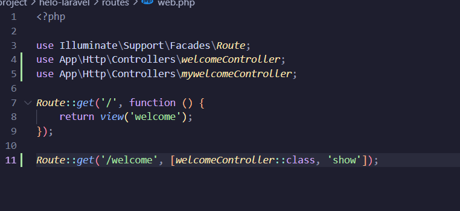
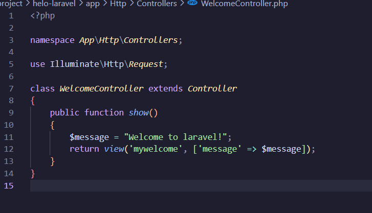
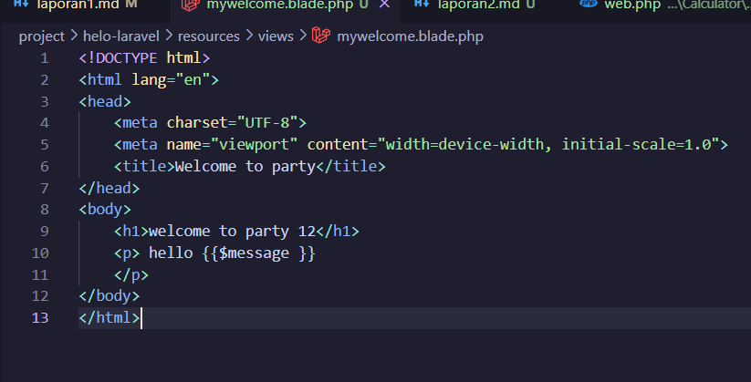
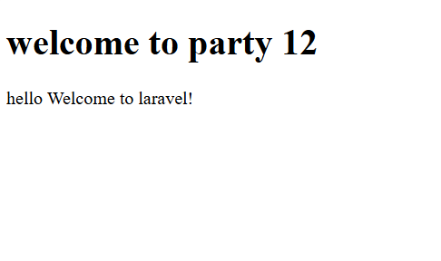
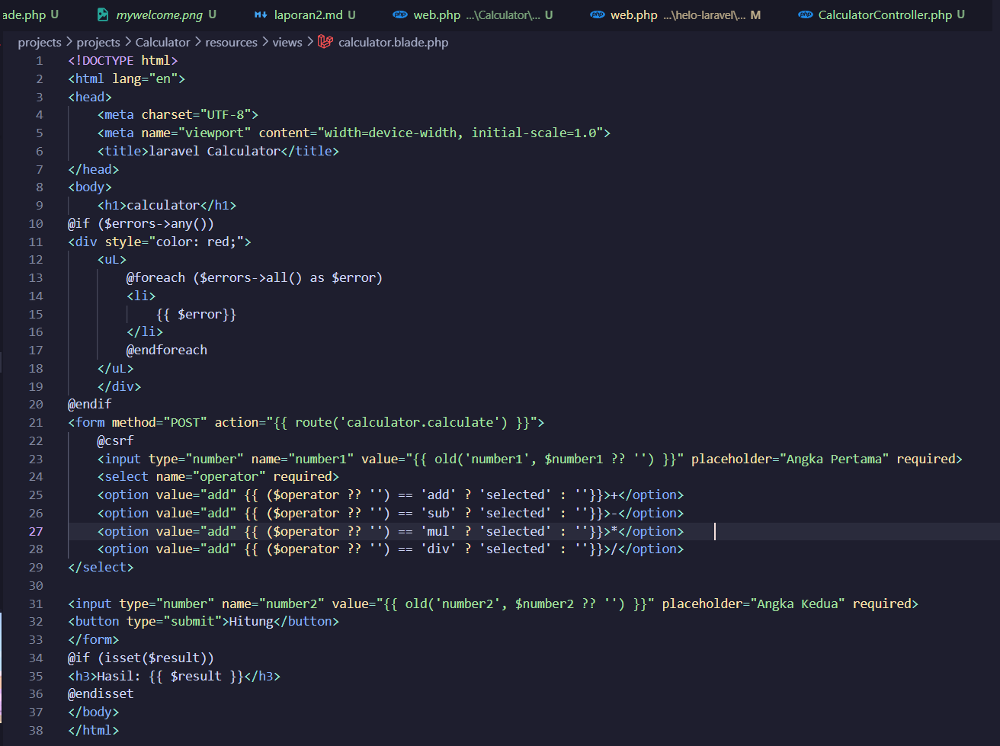
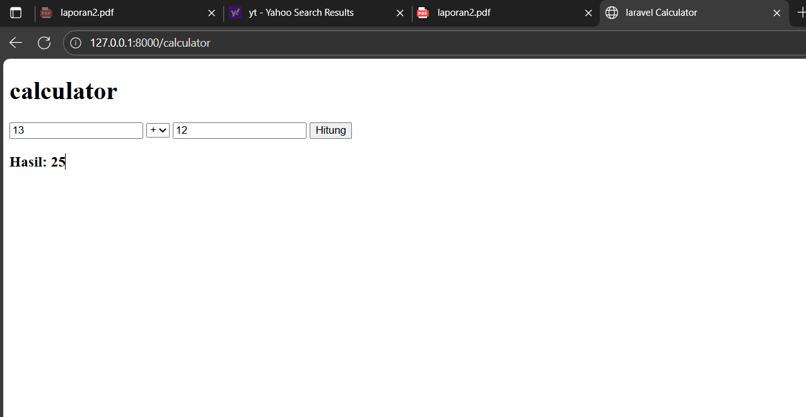

# Laporan Modul 2: Laravel Fundamentasl
**Mata Kuliah:** Workshop Web Lanjut   
**Nama:** Hayzar Muhaiyar 
**NIM:** 2024573010100
**Kelas:** TI-2C

---

## Abstrak 

Laporan ini membahas dasar-dasar penggunaan Laravel pada modul 2 dengan fokus pada konsep MVC, routing, middleware, serta cara Laravel menangani request dan response. Praktikum dilakukan dengan membuat route, controller, dan view menggunakan Blade Templating Engine. Selain itu, dibuat juga aplikasi sederhana berupa "Calculator" untuk memahami alur kerja Laravel dari request hingga response.

--- 

## 1. Dasar Teori
- Apa itu MVC (Model, View, Controller).
 MVC adalah pola arsitektur perangkat lunak yang memisahkan logika aplikasi menjadi tiga bagian utama:
Model: Mengelola data dan logika bisnis.
View: Bertugas menampilkan data dalam bentuk antarmuka pengguna.
Controller: Menjembatani antara Model dan View dengan menangani input serta mengatur alur aplikasi.

- Konsep Routing di Laravel.
Routing berfungsi untuk menentukan ke mana request pengguna akan diarahkan. Laravel mendukung route sederhana, route dengan parameter, route ke controller, hingga route group. Semua didefinisikan di file routes/web.php.

- Fungsi Middleware.
Middleware adalah lapisan penghubung yang memproses HTTP request sebelum mencapai controller. Contoh penggunaannya adalah autentikasi, validasi request, logging, atau filtering request.

- Bagaimana cara Laravel menangani Request dan Response.
Laravel menggunakan HTTP Kernel untuk menerima request, kemudian melewati middleware, diteruskan ke route, lalu controller, dan hasil akhirnya dikembalikan dalam bentuk response ke browser.

- Peran Controller dan View.
controller: Menangani logika aplikasi, memproses input, dan memilih view yang tepat untuk ditampilkan.
View: Bertugas menampilkan hasil ke pengguna. Di Laravel, view menggunakan Blade Templating Engine.

- Fungsi Blade Templating Engine.
Blade adalah template engine Laravel yang memungkinkan pembuatan tampilan dinamis dengan sintaks sederhana, mendukung layouting, inheritance, dan directive seperti @if, @foreach, dll.
---

## 2. Langkah-Langkah Praktikum
Tuliskan langkah-langkah yang sudah dilakukan, sertakan potongan kode dan screenshot hasil.
2.1 Praktikum 1 – Route, Controller, dan Blade View

- Tambahkan route pada routes/web.php.
buka folder routes/web.php
kemudian isi dengan kode berikut:

route ini akan memberitahu laravel untuk memanggil method show() yang ada di dalam file WelcomeController ketika user mengunjungi /welcome.

- Buat controller WelcomeController.
Buka terminal(git bash) dan jalankan perintah berikut untuk membuat controller.
php artisan make:controller WelcomeController
kemudian isi dengan kode berikut

- Buat view mywelcome.blade.php.
buat file bernama mywelcome.blade.php di dalam folder resources/views
selanjutnya isi dengan kode berikut

- Jalankan aplikasi dan tunjukkan hasil di browser.
ketik php artisan serve di git bash atau terminal

Screenshot Hasil:

2.2 Praktikum 2 – Membuat Aplikasi Sederhana "Calculator"

- Tambahkan route untuk kalkulator.
buka folder routes/web.php
kemudian isi dengan kode berikut:   
Route::get('/calculator', [CalculatorController::class, 'index']);
Route::post('/calculator', [CalculatorController::class, 'calculate'])->name('calculator.calculate');

- Buat controller CalculatorController.
buka terminal atau gitbash kemudian ketik kode berikut 
php artisan make:controller WelcomeController

- Tambahkan view calculator.blade.php.
buat file bernama calculator.blade.php di dalam folder resources/views
selanjutnya isi dengan kode berikut

- Jalankan aplikasi dan coba dengan beberapa input berbeda.
buka terminal atau gitbash kemudian ketik kode berikut 
php artisan make:controller WelcomeController;

Screenshot Hasil:

---

## 3. Hasil dan Pembahasan
Jelaskan apa hasil dari praktikum yang dilakukan.
- Apakah aplikasi berjalan sesuai harapan?
Aplikasi berjalan sesuai harapan. Route dapat mengarahkan request ke controller yang tepat, lalu menampilkan view menggunakan Blade.

- Apa yang terjadi jika ada input yang salah (misalnya pembagian dengan 0)?
Pada kalkulator, operasi penjumlahan, pengurangan, perkalian, dan pembagian dapat dijalankan dengan baik.
Jika pengguna mencoba membagi dengan angka 0, sistem akan menampilkan pesan error karena validasi sudah ditangani di controller.

- Bagaimana validasi input bekerja di Laravel?
Validasi input di Laravel dilakukan dengan $request->validate(), yang otomatis memberikan feedback jika ada input yang tidak sesuai aturan.

- Apa peran masing-masing komponen (Route, Controller, View) dalam program yang dibuat?
Peran komponen dalam program:
Route → Mengarahkan request ke controller yang sesuai.
Controller → Memproses logika perhitungan dan menentukan view yang akan ditampilkan.
View → Menampilkan hasil kalkulasi dalam format HTML.

---

## 4. Kesimpulan

Tulis kesimpulan dari praktikum ini
Dari praktikum ini dapat disimpulkan bahwa:
Laravel mempermudah pengembangan aplikasi web dengan konsep MVC.
Routing berfungsi sebagai penghubung antara URL dan controller.
Controller mengatur logika bisnis aplikasi, sementara View mengatur tampilan dengan bantuan Blade Templating Engine.
Middleware berperan penting dalam memproses request sebelum mencapai controller.
Contoh Projek Kecil "Calculator" berhasil menunjukkan bagaimana alur request → controller → view bekerja secara menyeluruh di Laravel.
---

## 5. Referensi
Cantumkan sumber yang Anda baca (buku, artikel, dokumentasi) — minimal 2 sumber. Gunakan format sederhana (judul — URL).
chatgpt.com
https://hackmd.io/@mohdrzu/B1zwKEK5xe
https://laravel.com/docs
---
